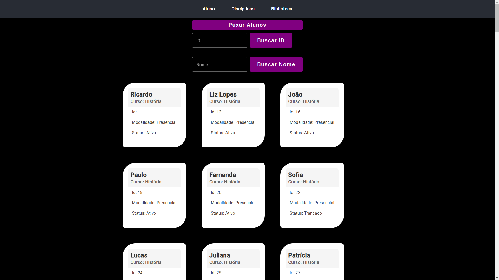
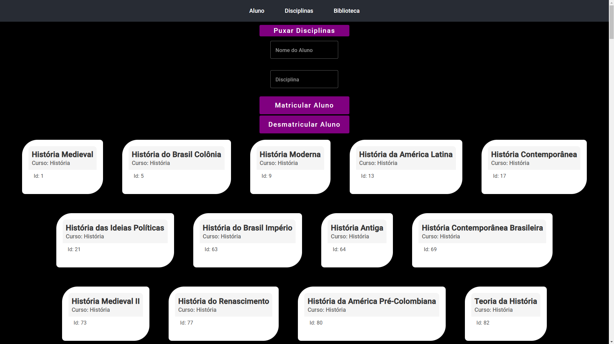
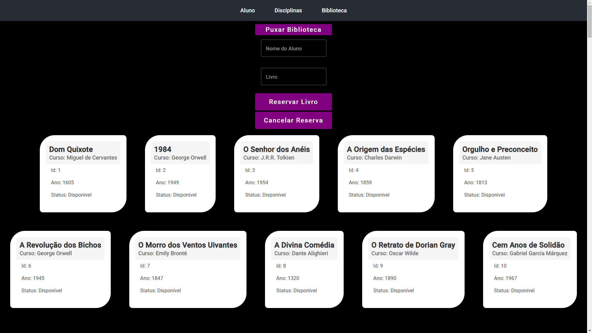

# Mini Projeto 💻
Este foi um projeto desenvolvido durante a disciplina de Projeto de Arquitetura de Sistemas. Aqui foi utilizado **Angular 16** para criar as *Views* e **Spring Boot** para a criação da API onde está os Controllers, Services, Repositories e consumo de API's fornecidas pelo professor.

## Arquitetura e Padrões de Projeto 🏗️

Foi utilizada uma **Arquitetura de Microsserviços**, ou seja, cada model tinha seu próprio microsserviço pronto para consumir e conseguir fazer a API ser alimentada e responder as requisições HTTP. Como padrão foi necessário usar o **MVC**(Model, View, Controller).  

## Repositórios 📤

O projeto foi separado em dois repositórios:
- Front-end (esse atual)
- [Back-end](https://github.com/caiosss/mini-projeto-arq-sistemas)

## Cenário 🎬

O cenário principal deste projeto é a simulação de matriculas e reservas de livros em uma universidade. O aluno, caso esteja ativo no curso, é capaz de se matricular na disciplina desejada e se quiser poderá reservar livros diretamente na biblioteca. 

## Como funciona? 🤔

Quando o usuário aperta no botão de puxar alunos, disciplinas ou biblioteca é feita uma requisição **HTTP** do tipo **GET**. Ao puxar os dados, dentro do método do controlador há a persistência desses dados em memória utilizando o banco de dados H2 disponibilizado pelo **Spring Boot**. Dessa maneira, há uma facilidade em fazer requisições para buscar ou atualizar, pois basta chamar pelo banco de dados.

## Contribuidores 🎉
- Caio (mantedor do projeto)

---

 Feito com ☕ por Caio

